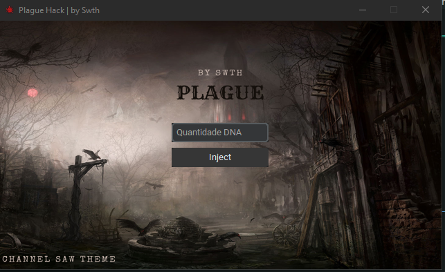

# Plague Hack


Este é um projeto Python que utiliza o `CustomTkinter` para interface gráfica e o `pymem` para manipulação de memória de processos. Ele foi desenvolvido para trabalhar com o jogo `Plague Inc: Evolved`, permitindo alterar valores específicos no jogo, como a quantidade de DNA.

---

## Funcionalidades

- **Interface gráfica moderna**: Desenvolvida com `CustomTkinter`, permite uma interação fácil e intuitiva.
- **Manipulação de memória**: Utiliza `pymem` para modificar valores no processo do jogo.
- **Configurações dinâmicas**: Leitura de configurações a partir de um arquivo JSON.
- **Compatível com Windows**: Compilado em executável `.exe`.

---

## Estrutura do Projeto

A estrutura do projeto está organizada da seguinte forma:

```
Plague/
├── app/
│   ├── models/
│   │   ├── src/
│   │   │   ├── background.png   # Imagem de fundo da interface
│   │   │   ├── virus.ico        # Ícone da janela
│   │   │   └── settings.json    # Arquivo de configuração
│   │   ├── display.py           # Interface gráfica
│   │   └── inject.py            # Lógica de manipulação de memória
├── pointers/                    # Arquivos de ponteiros do processo
├── .gitignore                   # Arquivos ignorados pelo Git
├── main.py                      # Arquivo principal do programa
├── plague.png                   # Ícone do executável
└── README.md                    # Documentação do projeto
```

---

## Pré-requisitos

Antes de compilar ou executar o projeto, instale os seguintes pacotes:

- `CustomTkinter`
- `Pymem`
- `Pillow`

Para instalar os pacotes, use:

```bash
pip install customtkinter pymem pillow
```

---

## Como Executar

1. **Executar o projeto diretamente**:
     - Acesse a pasta build.0.03
   - Execute o Plague.exe após abrir o jogo
   - Divirta-se
---

## Imagens da Janela

### Interface Principal


## Contribuições

Contribuições são bem-vindas! Se encontrar algum problema ou tiver uma sugestão, abra uma _issue_ ou envie um _pull request_.

---

## Licença

Este projeto é licenciado sob a licença MIT. Consulte o arquivo `LICENSE` para mais informações.
